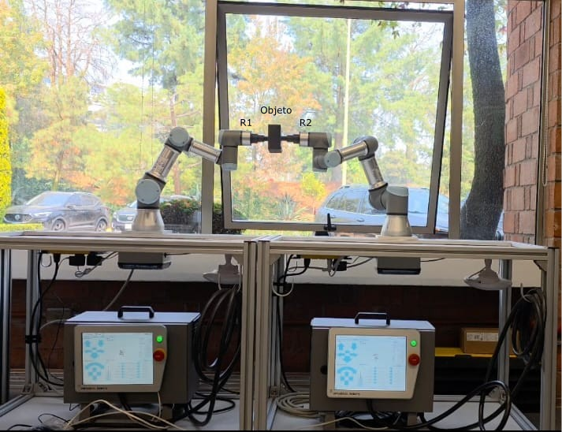
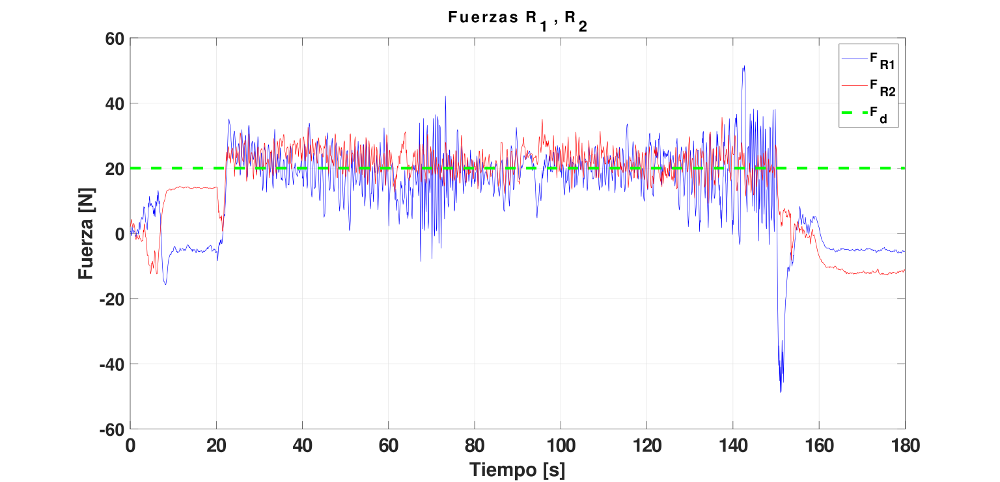

# Control de Manipuladores para Tareas de Agarre basado en Sistemas Multi-Agente (MARS)

Este repositorio contiene el código fuente, modelos de simulación y documentación técnica de la tesis doctoral enfocada en la manipulación cooperativa utilizando brazos industriales **Universal Robots (UR3)**.



*Figura 1: Plataforma experimental para ejecuci´on de tarea de agarre multi-agente*

## 📝 Resumen
Esta investigación propone un esquema de control híbrido que integra la técnica de **enjaulamiento cooperativo (caging)** con la regulación dinámica de fuerza mediante **control de admitancia**. El sistema permite que múltiples manipuladores coordinen sus movimientos para asegurar la integridad de un objeto durante su transporte. 

Un aporte principal es la superación de las limitaciones de hardware de la serie **UR3 CB-Series** (que carece de sensores de fuerza nativos) mediante una arquitectura abierta asíncrona en Python, utilizando estimación indirecta de fuerza y filtrado digital avanzado.

## 🦾 Características Principales
* **Arquitectura Abierta:** Implementación de comunicación asíncrona mediante sockets TCP/IP y protocolo RTDE.
* **Sistemas Multi-Agente (MARS):** Algoritmos basados en Funciones de Potencial Artificial (APF) para la formación y evasión de colisiones.
* **Control de Admitancia:** Algoritmo discreto para la regulación de fuerza de contacto sin transductores externos.
* **Procesamiento de Señal:** Filtrado digital IIR de primer orden para mitigar el ruido en la estimación de corriente.
* **Soporte Heterogéneo:** Validación experimental en plataformas UR3 CB-Series y e-Series.


## 🛠️ Estructura del Repositorio
* `/src`: Scripts de control en Python (lógica de admitancia, MARS y comunicación).
* `/sim`: Entornos de simulación en RoboDK y validaciones en MATLAB/Simscape.
* `/certificados`: Certificaciones oficiales de Universal Robots Academy (Core, Pro, Advanced).

## 📋 Requisitos
* Python 3.8+
* Librerías: `urx`, `math`, `time`, `sys`,`os`, `matplotlib.pyplot`, `numpy`, `pandas`.
* Hardware: Universal Robots UR3 (CB3 o e-Series) con puerto Ethernet habilitado.

## 🦾 Resultados Experimentales 🦾

La validación del esquema de control multi-agente y admitancia se llevó a cabo utilizando dos manipuladores **UR3 CB-Series**. El objetivo central fue estabilizar la fuerza de contacto en **20 N** para sostener un objeto de TPU impreso en 3D en el aire, superando la latencia de red y la ausencia de sensores de fuerza nativos.

### 🎥 Demostración en Video
### 🎥 Demostraciones en Video

A continuación se presentan los enlaces a YouTube con los registros del experimento físico, donde se observa el desempeño de la arquitectura asíncrona y la respuesta de los manipuladores UR3:

* 🔗 **[Video 1: Fase de aproximación y enjaulamiento (Caging)](https://youtu.be/s8URMMskm30)**
  Se observa la convergencia de los agentes hacia el objeto de TPU y el cierre de la formación geométrica.

* 🔗 **[Video 2: Replicabilidad de experimento I](https://youtu.be/uXbJGvHOyeA)**
  Demostración 2 de propuesta de solución al tema de investigación

* 🔗 **[Video 3: Replicabilidad de experimento II](https://youtube.com/shorts/58dO3bSfA-E?feature=share)**
  Demostración 3 de propuesta de solución al tema de investigación

### 📊 Análisis Dinámico del Lazo de Control

Durante el intervalo de contacto activo ($20 \le t \le 150$ s), el sistema demostró una robustez excepcional frente a la incertidumbre del hardware.


*Figura 2: Respuesta del controlador de fuerza a una consigna de 20 N. Se observa la mitigación del chattering gracias al filtro IIR de 5 Hz.*

**Métricas Clave Obtenidas:**
* **Frecuencia de actualización real:** $\approx 9.4$ Hz (compensando asincronía de Python).
* **Esfuerzo de corrección ($x_r$):** Desplazamientos micrométricos máximos de $18.5$ mm en $R_1$ y $12.0$ mm en $R_2$, absorbiendo la deformación plástica del TPU.
* **Estabilidad:** Prevención total de sobrecarga térmica y mantenimiento ininterrumpido de la formación geométrica.

## 🎓 Autor
**Julio Antonio Caballero Mora** Doctorado en Ingeniería Aplicada / Sistemas Mecatrónicos  
Universidad Veracruzana-Universidad Iberoamericana, México.

## 📄 Cita (Citation)
Si utilizas este código o los conceptos de esta investigación en tu trabajo académico, por favor cítalo de la siguiente manera:

```bibtex
@phdthesis{CaballeroMora2026,
  author = {Julio Antonio Caballero Mora},
  title = {Control de Manipuladores para Tareas de Agarre basado en Sistemas Multi-Agente},
  school = {Universidad Veracruzana},
  year = {2026},
  address = {Veracruz, México},
  type = {Tesis Doctoral}
}
